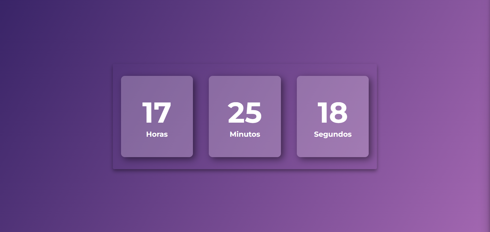

<h1 align="center"> Relógio Digital </h1>

Este é um relógio digital personalizado.  

  <a href="#-ferramentas">Ferramentas</a>&nbsp;&nbsp;&nbsp;|&nbsp;&nbsp;&nbsp;
  <a href="#-projeto">Projeto</a>

  

##  Ferramentas

Esse projeto foi desenvolvido com as seguintes ferramentas:

- HTML e CSS
- JavaScript
- Git e Github

##  Projeto

Este foi um projeto pessoal que me permitiu explorar algumas ferramentas do JavaScript. Decidi criar um relógio digital totalmente personalizado do zero, o que me permitiu exercitar meus conhecimentos de CSS.

