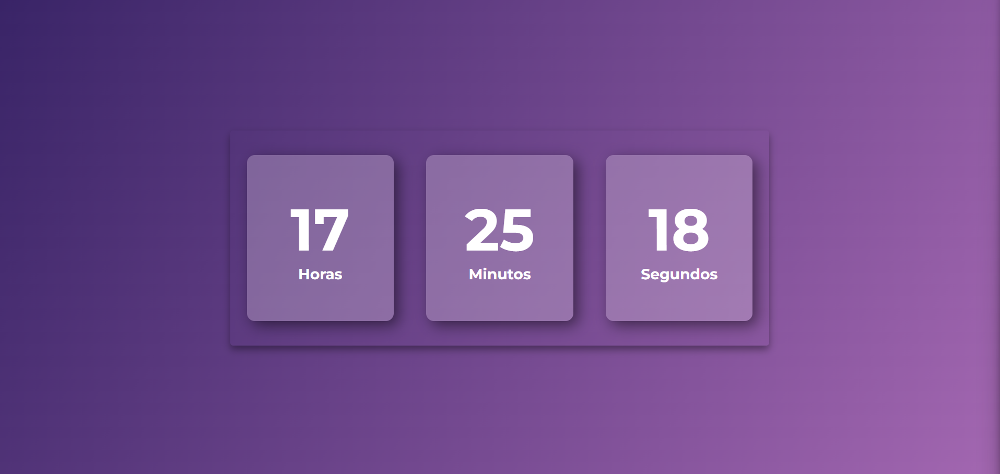

<h1 align="center"> Relógio Digital </h1>

Este é um relógio digital personalizado.  

  <a href="#-ferramentas">Ferramentas</a>&nbsp;&nbsp;&nbsp;|&nbsp;&nbsp;&nbsp;
  <a href="#-projeto">Projeto</a>&nbsp;&nbsp;&nbsp;|&nbsp;&nbsp;&nbsp;
    <a href="#-layout">Aprendizado</a>

  

## 🚀 Ferramentas

Esse projeto foi desenvolvido com as seguintes ferramentas:

- HTML e CSS
- JavaScript
- Git e Github

## 💻 Projeto

## ✏️ Aprendizado

